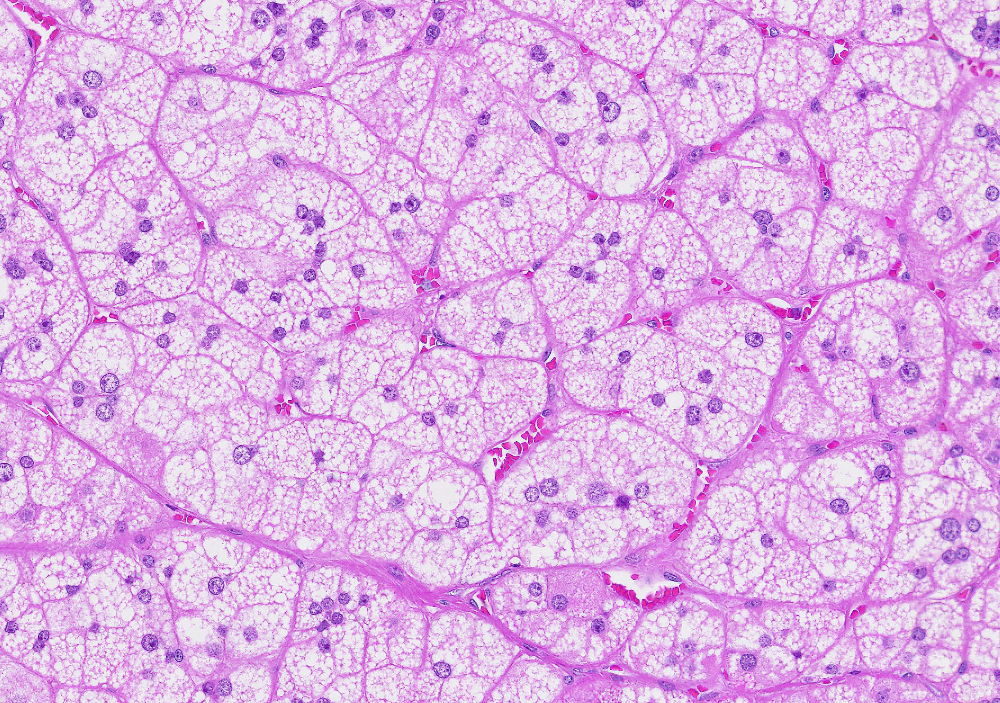
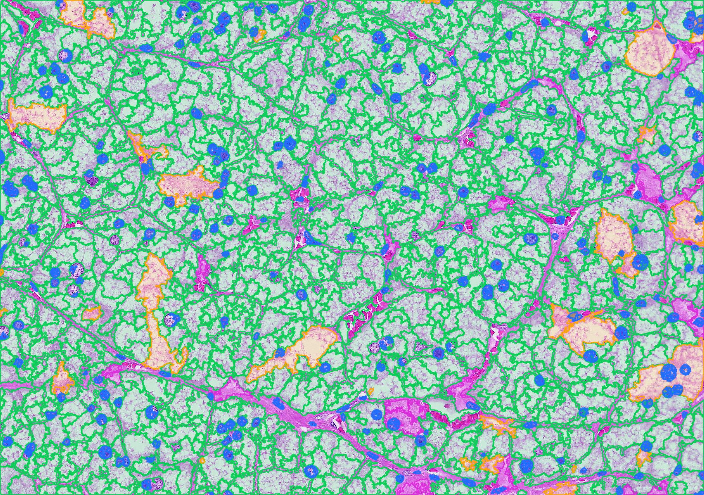

# QuPath H&E Cell Nuclei Detector

QuPath extension for H&E pathology cell boundary and nuclei detection with area quantification.

This folder is intentionally scoped for GitHub upload: it contains only the QuPath extension wrapper, the required Prototype 1 Python runner, installation docs, and lightweight project metadata. It does not include notebooks, WSI tiles, random run outputs, presentation files, or local research artifacts.

## Features

- Adds `Extensions > Prototype 1 > Run on selected annotation(s)` to QuPath.
- Runs the Python Prototype 1 pipeline on selected annotation bounding boxes.
- Imports cell boundaries and nuclei as QuPath detection objects.
- Adds QuPath measurement columns for cell area, cytoplasm area, nuclear area, N/C ratio, and nucleus morphometry.
- Adds `_um2` area columns automatically when QuPath image calibration is available.
- Optional before/after PNG export for each ROI.
- Class colors:
  - Nucleus: blue
  - Clear cell: green
  - Compact cell: magenta
  - Uncertain: orange
  - Mesenchyme/stroma: red

## Before and After Example

| Raw ROI | Prototype 1 overlay |
|---|---|
|  |  |

More details: [before/after demo](docs/before_after_demo.md).

## Folder Structure

```text
qupath_extension_release/
├── README.md
├── LICENSE
├── requirements.txt
├── build_extension.sh
├── install_to_qupath.sh
├── python/
│   └── single_image_pathology_prototype.py
├── src/
│   └── main/
│       ├── java/
│       └── resources/
├── docs/
│   ├── install.md
│   ├── usage.md
│   └── troubleshooting.md
└── assets/
    └── README.md
```

## Requirements

- QuPath 0.7.x.
- Python 3.10+.
- Python dependencies in `requirements.txt`.
- Java/JDK for building the extension JAR.
- CPU is sufficient; GPU is not required.

## Quick Install

1. Create a Python environment:

```bash
cd qupath_extension_release
python3 -m venv .venv
source .venv/bin/activate
pip install -r requirements.txt
```

2. Build the extension:

```bash
./build_extension.sh
```

3. Install into QuPath:

```bash
./install_to_qupath.sh
```

4. Restart QuPath.

## Configuration

The bundled Groovy script checks these environment variables:

```bash
export PROTOTYPE1_HOME="/path/to/qupath_extension_release"
export PROTOTYPE1_PYTHON="/path/to/qupath_extension_release/.venv/bin/python"
export PROTOTYPE1_PIPELINE="/path/to/qupath_extension_release/python/single_image_pathology_prototype.py"
export PROTOTYPE1_OUTPUT="/path/to/output/folder"
```

`PROTOTYPE1_HOME` is required. If `PROTOTYPE1_PYTHON` is not set, the extension uses `.venv/bin/python` on macOS/Linux or `.venv/Scripts/python.exe` on Windows under `PROTOTYPE1_HOME`.

## Usage in QuPath

1. Open an image in QuPath.
2. Draw/select one annotation ROI.
3. Run `Extensions > Prototype 1 > Run on selected annotation(s)`.
4. Keep `Display like InstanSeg detections` checked.
5. Check `Export before/after PNGs` if you want before/after images.
6. Open measurement tables:
   - `Measure > Show detection measurements`
   - `Measure > Show annotation measurements`

## Outputs

Each run writes a timestamped folder:

```text
qupath_extension_runs/<image>_<timestamp>/
├── before_after_png/
├── exported_tiles/
├── processed/
└── prototype1_qupath_run.log
```

Important measurement columns:

- `Prototype1: cell_area`
- `Prototype1: cytoplasm_area`
- `Prototype1: nuclear_area`
- `Prototype1: n_c_ratio`
- `Prototype1: area`
- `Prototype1: cell_area_um2`
- `Prototype1 summary: parenchyme_nuclear_area_px`
- `Prototype1 summary: parenchyme_cytoplasm_area_px`
- `Prototype1 summary: parenchyme_nuclear_area_um2`

## GitHub Upload Recommendation

For development inside a larger workspace, upload this folder only:

```bash
git add .
git commit -m "Release QuPath H&E cell nuclei detector"
```

Recommended repository description:

> QuPath extension for H&E pathology cell boundary and nuclei detection with area quantification.

Recommended topics:

`qupath`, `digital-pathology`, `computational-pathology`, `cell-segmentation`, `nuclei-segmentation`, `histology`, `he-staining`
